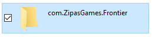
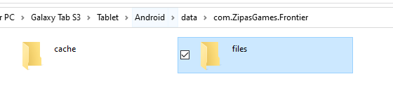
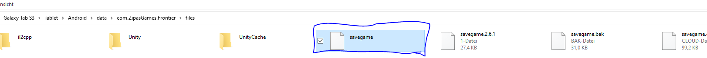

# My very advanced gamestand on event horizon frontier

[link to direct download](https://github.com/pascal-gerber/event-horizon-gamefiles/raw/bde43214bb4fac859f62bab94cc8aff7aa5eb517/savegame)

first you download even horizon frontier either trought 
[play store](https://play.google.com/store/apps/details?id=com.ZipasGames.Frontier)
or 
[Directly as apk (apkpure)](https://d.apkpure.com/b/APK/com.ZipasGames.Frontier?version=latest) "doesnt require a google account"

now, event horizon acts kinda wierd on inputting gamestands
first you will have to find the file named "com.ZipasGames.Frontier" in (Android/data/com.ZipasGames.Frontier) maybe do it on your computer
rename it to something different like just adding a 1 to it such as "com.ZipasGames.Frontier1" just so that when you deinstall the game again it wont rip it with the deinstallation then once deinstalled, you want to rename it back but in the file (/com.ZipasGames.Frontier/files) input the "savegame" file into before, then once all these steps are done, you can play it with my gamestand

in images here

1. 
2. 
3. 

### Gamestand and tutorial made by pascal
Enjoy!!!